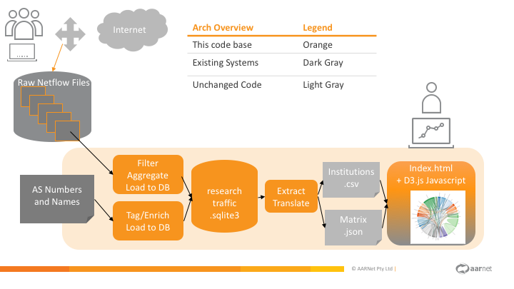

# Data Visualisation

These scripts form the Proof of Concept for providing a way to visualise network traffic as a proxy measure for 
eResearch collaboration between Research and Education institutions.

The D3.js visualisation code is heavily based on the [example Chord Diagrams from D3.js](https://github.com/d3/d3/wiki/Gallery) by [Mike Bostok](https://bl.ocks.org/mbostock/1046712).



As it's input it takes:
1. Netflow records stored in nfcapd files
2. Mapping for Autonomous System from Numbers to Names

As a process it:
1. Filters by research looking flows
2. Aggregates traffic by source and destination Autonomous Systems
3. Formats the data in a format easily used by D3js

As an output it generates:
1. Chord diagrams showing the traffic relationships between institutions
2. Underlying data in JSON file.


### Processing data 
1. The data for Autonomous System (AS) Numbers and names comes from two csv files:
    * autnums.csv: which is included here derived from public BGP data
    * private_asnums.csv: which is not included here and in which you can your private asn data
2. The system puts some limits around how many institutions are displayed on the chord diagram.
Currently that is limited to ~50 with a everything else captured in a default "All Other" bucket.
Some institutions are also force included (eg: known biggest universities in Australia's Group of 8). 
You can edit this in nfdump_aggregation_to_research_traffic.py 
3. Set the source directories for your netflow record files in the environment variable
 $NETFLOW_BASE_DIR (or use the default value of "./netflow" if it's not specified)
4. Install dependent libraries and apps
    * nfdump command line tools (available in package format for most linux distros)
    * python libraries: pandas, pathlib 
    ```$ pip install pandas pathlib```
    
5. Run the go_all script to process all files in a month
```
$ ./go_all.sh 201802 my-router-a my-router-b my-router-c
```

6. OR run the go script to process a particular day
```
$ ./go.sh 20180205 my-router-a my-router-b
Generating list of research related ASNs ...
Generating summary of research like flows ...
Generating Chord Diagram data files of research institution traffic ...
Completed successfully.
```
7. Load the file 'index.html' locally in your browser.
This will also load two files created by the above process: 'institutions.csv' and 'matrix.json'
 
 
### Build a standalone container to run this on an internal website
1. Build and run the docker image of this in a standalone website
```
$ ./publish.sh
```
2. Open the URL http://my-internal-server 


### FAQ and Troubleshooting
#### Opening index.html does not render a chord diagram
If you don't see a diagram when you open index.html then there is a good chance that 
you've run the processing with some incorrect settings and then rerun the process with
correct settings but there is some intermediate cached data left over from the first run.
Try cleaning the cached files.
* CSV output from nfdump aggregration is stored in the data directory
```rm data/*.csv```
* Enriched ASN Mapping information is cache in the file asn_data csv.
```rm asn_data.csv```
* Cache of which days and router already have data loaded is stored in the DB
```rm db/all_traffic.sqlite```

#### I changed something in code but can't see the change reflected in the chord diagram
As above it. It's probably something cached somewhere.
Work backwards and check in order 
* contents of matrix.json & institutions.csv which comes from
* contents of aggregrate tables in db/all_traffic.sqlite which come from
* contents data/*.csv files and asn_data.csv.

#### Some chords show XXTerabytes in one direction and 0Terabytes in the other
This is expected. It comes from the threshold filtering that only sets a link with a
value if it's beyond a certain threshold. Currently that's 100Gbytes and can
be configured in nfdump_aggregration_to_research_traffic.py

### Future Improvements "todo" list
1. Move to a shared SQL DB.
2. Move index.html to react based app with API queries to backend that allow more filtering.
   Let a user choose date ranges or add/remove particular institutions.
3. Setup filters per router to collect from only the specific interfaces.